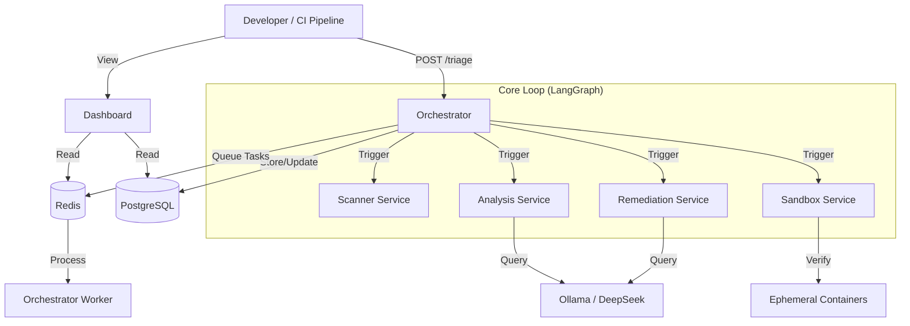

# System Architecture

## Overview

The **Universal Security Brain** follows a **Microservices Architecture** pattern, orchestrated by a central API gateway (`Orchestrator`). It is containerized using Docker and orchestrated via Docker Compose for local development.

## High-Level Diagram

## Core Components

### 1. Orchestrator (The Brain)

- **Tech Stack**: Python, FastAPI, LangGraph.
- **Responsibility**: Manages the state machine of the security workflow. It decides which step to execute next (Scan -> Analyze -> Remediate -> Verify).

### 2. Specialized Agents

- **Scanner**: Adapts output from various security tools (Semgrep, Trivy, etc.) into a canonical format.
- **Analysis**: Uses Large Language Models (LLMs) to understand code context and filter false positives.
- **Remediation**: Generates patches for validated vulnerabilities.
- **Sandbox**: A secure environment to run exploits and tests without risking the host system.

### 3. Data persistence

- **PostgreSQL**: Relational data (Findings, Scans, Feedback).
- **Redis**: Caching and Message Broker for Celery.

### 4. Observability

- **Grafana, Loki, Prometheus**: Full stack monitoring for logs and metrics.

## Design Principles

- **Shift-Left**: Integration happens early in the CI/CD pipeline.
- **Agentic Workflow**: The system is not just a linear script but a graph of decision-making nodes (LangGraph).
- **Human-in-the-Loop**: Critical decisions can be paused for manual review.
- **Self-Healing**: The system attempts to fix problems, not just report them.
